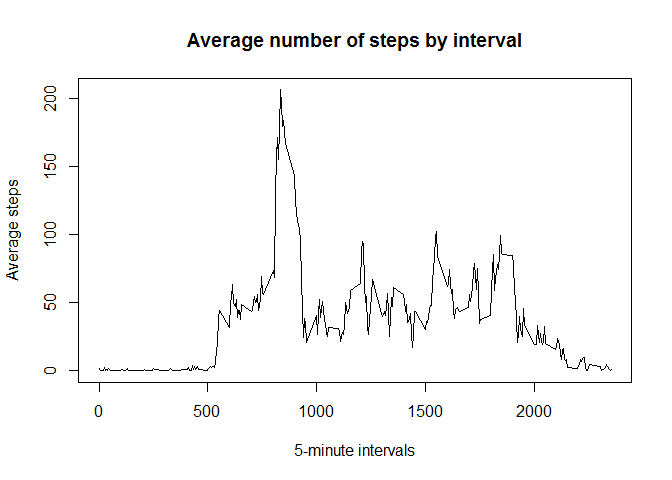

# Reproducible Research: Peer Assessment 1
Sneha Godbole  


## Loading and preprocessing the data

For this part of the assignment, we need to read in the CSV file into an R object. The date column gets read as a character vector, so we will convert it to a proper Date format.


```r
# Read data from CSV file
activityData <- read.csv("./activity/activity.csv", stringsAsFactors = FALSE)

# Pre-process date from character vector to Date format
activityData$date <- as.Date(activityData$date, format = "%Y-%m-%d")
```

## What is mean total number of steps taken per day?


```r
# Calculate the total number of steps taken per day
na.values <- is.na(activityData$steps)
activityDataNoNA <- activityData[!na.values,]
total.steps.by.day <- aggregate(activityDataNoNA$steps, by = list(activityDataNoNA$date), FUN = sum)
colnames(total.steps.by.day) <- c("date", "steps")

# Make a histogram of the total number of steps taken each day
hist(total.steps.by.day$steps, main = "Total number of steps taken per day", xlab = "Number of Steps",
     ylab = "Frequency")
```

 

```r
# Calculate and report the mean and median of the total number of steps taken per day
total.steps.mean <- mean(total.steps.by.day$steps)
total.steps.median <- median(total.steps.by.day$steps)
```

The mean of the total number of steps taken per day is 1.0766189\times 10^{4} and the median of the total number of steps taken per day is 10765.

## What is the average daily activity pattern?


```r
# Make a time series plot (i.e. type = "l") of the 5-minute interval (x-axis) and the average number of steps taken, averaged across all days (y-axis)

avg.steps.byinterval <- aggregate(activityDataNoNA$steps, by = list(activityDataNoNA$interval), FUN = mean)
colnames(avg.steps.byinterval) <- c("interval", "avg.steps")

plot(avg.steps.byinterval$interval, avg.steps.byinterval$avg.steps, type = "l", 
     main = "Average number of steps by interval", xlab = "5-minute intervals", 
     ylab = "Average steps")
```

 

```r
# Which 5-minute interval, on average across all the days in the dataset contains the maximum number of steps?
max.steps <- max(avg.steps.byinterval$avg.steps)
max.steps.interval <- avg.steps.byinterval[avg.steps.byinterval$avg.steps == max.steps, 1]
```

### Which 5-minute interval, on average across all the days in the dataset contains the maximum number of steps?
The 835 interval contains the maximum number of steps.

## Imputing missing values


```r
# Find number of rows in the dataset that have a missing value
true.na.values <- length(na.values[na.values == TRUE])

# Fill in NA values with mean for the interval and create a new dataset
filled.activityData <- activityData

for(i in 1:nrow(filled.activityData)) {
  if(is.na(filled.activityData$steps[i])) {
    intv <- filled.activityData$interval[i]
    filled.activityData$steps[i] <- avg.steps.byinterval[avg.steps.byinterval$interval == intv, 2]
  }
}

filled.total.steps.by.day <- aggregate(filled.activityData$steps, 
                                       by = list(filled.activityData$date), FUN = sum)
colnames(filled.total.steps.by.day) <- c("date", "steps")

# Make a histogram of the total number of steps taken each day
hist(filled.total.steps.by.day$steps, main = "Total number of steps taken per day", 
     xlab = "Number of Steps", ylab = "Frequency")
```

 

```r
# Calculate and report the mean and median of the total number of steps taken per day
filled.total.steps.mean <- mean(filled.total.steps.by.day$steps)
filled.total.steps.median <- median(filled.total.steps.by.day$steps)
```

### Calculate and report the total number of missing values in the dataset(i.e. the total number of rows with NAs)

There are 2304 rows in the dataset with missing (i.e. NA) values.

### Calculate *mean* and *median* total number of steps taken per day. Do these values differ from the estimates from the first part of the assignment? What is the impact of imputing missing data on the estimates of the total daily number of steps?

There is not a significant change in the estimates as a result of imputing missing data. The median value 1.0766189\times 10^{4} has increased by a little more than one integer value from 10765. This could be because the average for each interval was used as replacement for the NA values.

## Are there differences in activity patterns between weekdays and weekends?


```r
# Create a new factor variable in the dataset with two levels - "weekday" and "weekend" indicating whether a given date is a weekday or weekend day.

allweekdays <- c("Monday", "Tuesday", "Wednesday", "Thursday", "Friday")
filled.activityData$dayofweek <- weekdays(filled.activityData$date, FALSE)
filled.activityData$dayofweek <- factor((filled.activityData$dayofweek %in% allweekdays), 
                                        levels = c(FALSE, TRUE), labels = c("weekday", "weekend"))


library(lattice)
xyplot(filled.activityData$steps ~ filled.activityData$interval | filled.activityData$dayofweek, 
       type = "l", layout = c(1, 2), xlab = "Interval" , ylab = "Number of steps")
```

 

The activity patterns of weekdays and weekends differ quite a bit. On the weekends individuals have taken more number of steps at almost each interval than over the weekdays. This may be due to the fact that individuals workout less during work hours.
